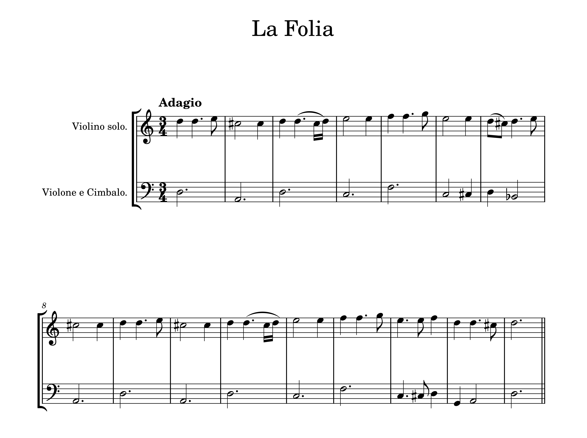

#  Arcangelo Corelli (1653–1713)

**Arcangelo Corelli** was a **pivotal figure** in the transition from early to high Baroque music. As both a composer and violinist, he played a **foundational role in shaping instrumental music**, laying the groundwork for future giants such as **Handel, Vivaldi, and J.S. Bach**.

---

##  Learning Objectives

By the end of this guide, learners will be able to:

- Identify Corelli’s contributions to Baroque music and violin technique.  
- Recognize key features of the **sonata da chiesa** and **concerto grosso** forms.  
- Analyze Corelli’s stylistic traits using **La Folia** as a case study.  
- Situate Corelli within the broader historical and cultural context of 17th-century Italy.

---

##  Historical Context

### **The Baroque Period (c. 1600–1750)**

- Marked by **contrast**, **ornamentation**, and **expressive intensity**.  
- Rise of **tonal harmony** and **instrumental music**.  
- Corelli exemplified and refined these characteristics.

### **Italy as a Musical Powerhouse**

- Rome was a hub for **Baroque innovation**.  
- Supported by patrons such as **Queen Christina of Sweden** and **Cardinal Pietro Ottoboni**.  
- Corelli’s music flourished within this **artistically rich environment**.

### **Rise of Instrumental Genres**

- Corelli broke from vocal dominance by writing **instrumental-only** music.  
- Helped establish:  
  - **Trio sonata**  
  - **Solo sonata**  
  - **Concerto grosso**

---

##  Corelli’s Contributions

### **Form and Style**

- Clarity, **balanced phrasing**, and **functional tonality**.  
- Codified **sonata da chiesa** (church sonata) and **sonata da camera** (chamber sonata) forms.

### **Violin Technique**

- As a violinist, he elevated the **technical and expressive** possibilities of the instrument.  
- Inspired composers and served as a **model for violin pedagogy**.

### **Pedagogical Legacy**

- Taught influential students like **Francesco Geminiani**.  
- Influenced contemporaries including **Handel**, **Vivaldi**, **J.S. Bach**, and **Heinrich Schütz**.

---

##  List of Important Works

| Year | Work | YouTube Link |
|------|------|--------------|
| 1714 | **Concerto grosso g-Moll, Op.6 No.8** (“Christmas Concerto”) | [▶ Listen](https://youtu.be/e68h3Qwm2OA?si=dFQh-q0p_usD4cYR) |
| 1714 | **Concerto grosso, Op.6 No.4** | [▶ Listen](https://youtu.be/3smZkpqXYHs?si=2jMfp9sKRogMjwbY) |
| 1689 | **Trio Sonata in D major, Op.3 No.2** | [▶ Listen](https://youtu.be/CwJRzYv6HNI?si=nBs1Is2bhpD5a67c) |
| 1700 | **Violin Sonata in D minor 'La Folia', Op.5 No.12** | [▶ Listen](https://youtu.be/VBJxHUTzcs0?si=p4RnCYt4wvjH8XgP) |
| 1714 | **Concerto grosso in D major, Op.6 No.1** | [▶ Listen](https://youtu.be/7aG8FOnAJE4?si=VCW_2MgmdjMIDkY-) |

---

##  Listening Guide: *La Folia*, Op.5 No.12

- **Form**: Theme and variations  
- **Mood**: Dramatic and expressive with dance-like energy  
- **Instrumentation**: Solo violin with continuo  

**Features to Listen For**:

- Repeated **bass pattern** anchoring the piece  
- Increasing **technical demands** and variation intensity  
- Rich **ornamentation** and violinistic flair

---

## 🖼 Instruments of the Period

**Baroque Violin**  
- Gut strings and lighter bow enabled nuanced articulation.

**Harpsichord**  
- Provided harmonic foundation as part of the continuo.

**Violone / Cello**  
- Offered bass line support in trio sonatas and concerti.

  
*Baroque violin and bow*

---

##  Composer Timeline

| Year | Event |
|------|-------|
| 1653 | Born in Fusignano, Italy |
| 1670s | Studied in Bologna and joined Accademia Filarmonica |
| 1675 | Moved to Rome and began working for Queen Christina of Sweden |
| 1681 | Published Op.1: Trio Sonatas |
| 1700 | Published **La Folia**, Op.5 No.12 |
| 1714 | Published **12 Concerti Grossi**, Op.6 |
| 1713 | Died in Rome; buried in the Pantheon |

---

##  Legacy

- Corelli is remembered as the **"father of the concerto grosso"**.  
- His works became a **foundation of violin education**.  
- Inspired later tributes such as **Rachmaninoff's "Variations on a Theme of Corelli, Op.42"**.

> "Corelli’s music speaks with elegance, grace, and depth — a timeless voice of the Baroque."

