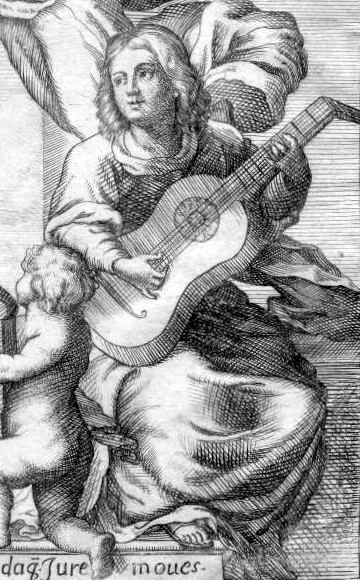

# Gaspar Sanz (Francisco Bartolome Sanz Celma, 1640-1710)

(Credit: Image that might be a portrait of Gaspar Sanz, from *Instrucción de Música sobre la Guitarra Española's dedication page*)

## About

Gaspar Sanz was a Spanish composer, Baroque guitarist, and priest. He studied Theology and Philosophy at the University of Salamanca, where he earned a Bachelor of Theology degree. After completing his studies in Spain, he traveled to Italy to study music, where he learned to play the Baroque guitar. During this time, he studied under several prominent Italian composers and guitarists, most notably Lelio Colista (1629–1680), who was praised by [Arcangelo Corelli](Arcangelo_Corelli.md) as one of the "più professori musici di Roma" (the most esteemed music professors in Rome).

Sanz began his professional career by teaching the guitar to Don Juan, the son of King Felipe IV of Spain. He later published a series of pedagogical works for the guitar, which were dedicated to Don Juan. These instructional books, compiled into three major volumes, contain the entirety of his surviving works.

In his pedagogical writings, Sanz detailed two main guitar playing techniques: punteado (plucked) and rasgueado (strummed), both of which form the foundation of modern classical guitar technique. He also used tablature notation for his compositions, a format that has remained widely used among guitarists to this day. Additionally, he introduced an alphabet-based chord system remarkably similar to the modern Nashville Number System.

Prior to Sanz’s contributions, there were few published musical works in Spain. His publications laid the groundwork for the Baroque guitar repertoire and had a lasting influence on Spanish classical music. Today, his works remain a fundamental part of classical guitar education and performance.
   
## List of Important Works

| Year | Works | Youtube | 
| ---- | ----- | ------- |
| 1674 | Instrucción de Música sobre la Guitarra Española | [Listen](https://youtu.be/MOcsy1Ewj6M?feature=shared) |
| 1675 | Libro Segundo de cifras sobre la guitarra española | [Listen]() |
| 1697 | Libro tercero de mùsica de cifras sobre la guitarra española | [Listen]() |

## Why Gaspar Sanz?

Since I have played classical guitar extensively, I still have a strong interest in the works of classical guitarists. However, while studying musicology and the history of Western music, I’ve noticed that classical guitar is rarely included in the main academic discourse. Despite this, classical guitar music has developed continuously, and Gaspar Sanz stands out as one of the most important figures who contributed to the evolution of the classical guitar and Spanish classical music.

Sanz is best known for his three pedagogical works, which laid the foundation for many aspects of modern guitar technique and notation. These works introduced key playing styles such as rasgueado and punteado, as well as the use of tablature and an alphabet-based chord system similar to the modern Nashville Number System. Remarkably, his compositions remain a frequently performed part of the classical guitar repertoire even today.
