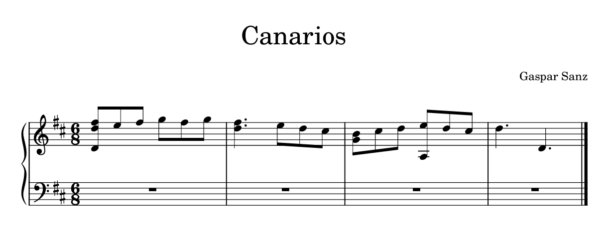

# Gaspar Sanz (Francisco Bartolome Sanz Celma, 1640-1710)

### Credit: Image that might be a portrait of Gaspar Sanz, from *Instrucción de Música sobre la Guitarra Española's dedication page*

Sanz, Gaspar is a Spanish composer, baroque guitarist, and also preist. He studied Theology and Philosophy, earing Bachelor of Theology degree from The University of Salamanca. After that he studied music in Italy, and learned how to play the baroque guitar while studying music.
   He started his career by teaching guitar to Don Juan, the son of Felipe IV. Sanz published his pedagogical works for guitar, dedicated to Don Juan. All of his works are contained in his three pedagogical publishments.
   In his pedagogical works, he specifies playing styles of Punteado and Rasqueado, which is now the main playing style of classical guitar. He also specifies scores written as Tablature(Tab) form, and Tablature score have been used to almost all guitar players. He even specifies alphabet chord systems which is very simillar to modern Nashvile system.
   Before Sanz's pedagogical works, there had been only few music-related publishments in Spain. His works were the basis of baroque guitar repatoir and Spanish classical music. Also, his works still form the important part of classical guitar pedagogy.
   
## List of Important Works

| Year | Works | Youtube | 
| ---- | ----- | ------- |
| 1674 | Instrucción de Música sobre la Guitarra Española | [Listen](https://youtu.be/MOcsy1Ewj6M?feature=shared) |
| 1675 | Libro Segundo de cifras sobre la guitarra española | [Listen]() |
| 1697 | Libro tercero de mùsica de cifras sobre la guitarra española | [Listen]() |

## Why Gaspar Sanz?
Since I had played the classical guitar a lot, I still have interested in classical guitarists' works. However while studying musicology and history of western music, there are only few works including classical guitar. But classical guitar works have been developed anyway, and Gaspar Sanz is the most important guitartist who has contributed to development of classical guitar and Spanish classical music.
Gaspar Sanz is famous for his three pedagogical works. There are the original forms of modern guitar playing styles and scores, such as Raequeado, Punteado, Tablature and Nashvile chords. And still his works are still repeatedly-played repatoir for present classical guitar works.
